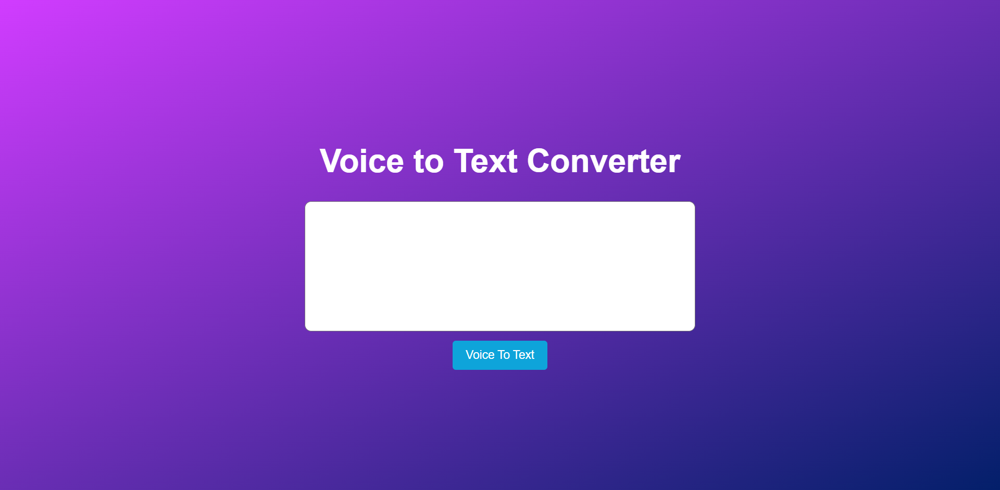

<h1 align="center">
  Speech To Text
</h1>

<h3 align="center">
  Web Application
</h3>

  

The "Speech to Text Converter" repository contains code related to a project that allows users to convert spoken words into text. This repository offers a valuable resource for developers who are interested in building their own speech-to-text conversion applications.
  
The code in the repository is written in a variety of programming languages, including Python and JavaScript, and uses a range of tools and libraries to perform the speech-to-text conversion. Some of the tools and libraries used include the Google Cloud Speech-to-Text API, the Web Speech API, and the SpeechRecognition library.
  
The code in the repository is well-organized and documented, making it easy for developers to understand and customize. The code also includes best practices for handling user input and managing errors, ensuring that the application is robust and user-friendly.

  
<!-- ................................................................................................................................. -->

### Features
 
Following are some of the new features and learning encountered while creating this amazing project:

- Support for multiple programming languages, including Python and JavaScript.
- Use of a range of tools and libraries to perform the speech-to-text conversion, such as the Google Cloud Speech-to-Text API and the SpeechRecognition library.
- Well-organized and documented code for easy customization and understanding.
- Best practices for handling user input and managing errors to ensure the application is robust and user-friendly.
- A valuable resource for developers who want to build their own speech-to-text conversion applications.
- Potential for customization and expansion with additional functionality to meet the specific needs of users and projects.
- Offers an opportunity for developers to learn and experiment with speech-to-text conversion and related concepts.
- Can save time and effort when building speech-to-text conversion applications by providing pre-built code and best practices.

  
<!-- ................................................................................................................................. -->

### Demo

  The Demo of this working project can be found on  
  <a href="https://rebrand.ly/SpeechToText_MABCORP">rebrand.ly/SpeechToText_MABCORP</a>

  
<!-- ................................................................................................................................. -->

### Video

You can exclusively watch the video on this project from the making to deploying on my     channel with the link given below 

  [Video Link](# )  

  If you like my video then do Like the Video and share it with others.

  
<!-- ................................................................................................................................. -->

### Application Interface

  
<!-- ................................................................................................................................. -->

### Technology Stack
 
Follwing technologies have been used at the core of this application to make it stand in the market place:

- HTML
- CSS
- JAvaScript

  
<!-- ................................................................................................................................. -->

### Advancement

> Nothing Recommended Yet

  
<!-- ................................................................................................................................. -->

### Deployment Details

The website is deployed using the free hosting provided by **Vercel**

  

  
Later on the link was customized using the well-known URL shortener and customizer **Rebrandly**:  

  

  
<!-- ................................................................................................................................. -->

### Developer

Muhammad Abdullah Butt  
abdullahbutt12292210@gmail.com  
> [Instagram](https://www.instagram.com/abdullah.butt.22/) 
> [FaceBook](https://www.facebook.com/profile.php?id=100076291614529) 
> [YouTube](https://www.youtube.com/channel/UCnuOFQyMywg-KuoN-lmav1Q) 
> [Portfolio](https://rebrand.ly/MuhammadAbdullahButt_MABCORP) 
> [Project Displayer]( https://rebrand.ly/ProjectDisplayer_MABCORP)
  
<!-- ................................................................................................................................. -->

